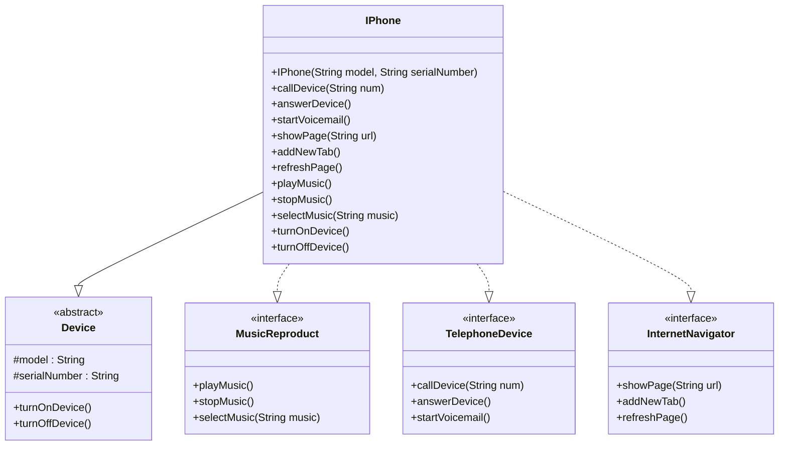

```mermaid
classDiagram

    class MusicReproduct {
        <<interface>>
        +playMusic()
        +stopMusic()
        +selectMusic(String music)
    }

    class TelephoneDevice {
        <<interface>>
        +callDevice(String num)
        +answerDevice()
        +startVoicemail()
    }

    class InternetNavigator {
        <<interface>>
        +showPage(String url)
        +addNewTab()
        +refreshPage()
    }

    class Device {
        <<abstract>>
        #model : String
        #serialNumber : String
        +turnOnDevice()
        +turnOffDevice()
    }

    class IPhone {
        +IPhone(String model, String serialNumber)
        +callDevice(String num)
        +answerDevice()
        +startVoicemail()
        +showPage(String url)
        +addNewTab()
        +refreshPage()
        +playMusic()
        +stopMusic()
        +selectMusic(String music)
        +turnOnDevice()
        +turnOffDevice()
    }

    IPhone --|> Device
    IPhone ..|> MusicReproduct
    IPhone ..|> TelephoneDevice
    IPhone ..|> InternetNavigator
```
